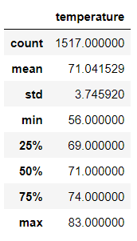

# surfs_up
## Purpose 
To analyze the temperature data for the months of June and December in Oahu, in order to determine if the surf and ice cream shop business is sustainable year-round.

## Results

Following two tables respectively showcase the data for June and December respectively
         
                                                                                                                            
  * Mean temperature for June and  December are both below 75 Fahrenheit.
  * Min temperature for June and  December are 64 and 56 Fahrenheit respectively.
  * 25th percentile for June and December are 73 and 69 Fahrenheit respectively.

## Results
Although the above mentioned data provides temperature data for June and December, One key factor which has been not catered for is the precipitation and the elevation measurements of all the stations.  From analyzing that data we can decide how we would like to build the shop and which areas would make prominent location for visitors to visit.
Precipitation query can be done in the following way:
For June

filter the Measurement table to retrieve the temperatures for the month of June.

**session.query(Measurement.date, Measurement.tobs).filter(extract('month',Measurement.date)==6).all()**

Convert the June temperatures to a list.**

**results = session.query(Measurement.date, Measurement.prcp).filterby(extract('month',Measurement.date)==6).all()**

Create a DataFrame from the list of temperatures for the month of June.

**df = pd.DataFrame(results, columns=['date','Precipitation'])
df.set_index(df['date'], inplace=True)
df.describe()**

